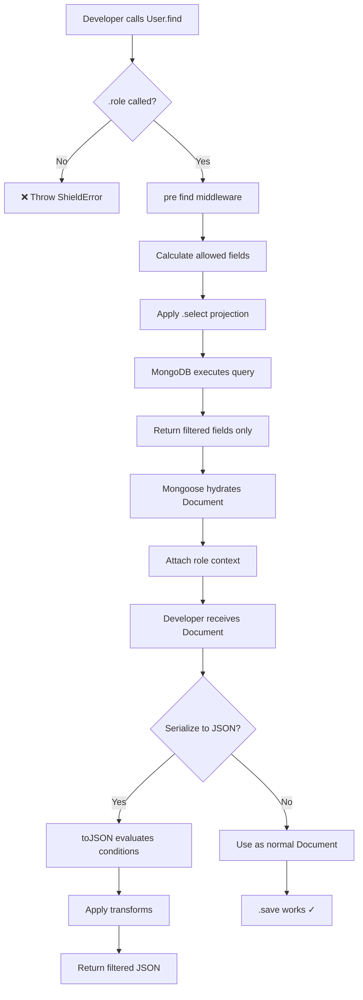

# FieldShield v2 - Implementation Plan

## Problem Statement

The current FieldShield implementation has critical architectural flaws that break Mongoose's contract:

1. **Broken Mongoose Documents** - Returns plain objects instead of Documents, breaking `.save()`, virtuals, and instance methods
2. **Missing `_id`** - Fields without `shield` config are filtered out, including `_id`
3. **Aggregation Bypass** - `Model.aggregate()` completely bypasses security
4. **Performance** - Fetches ALL data then filters in JS instead of using DB projections
5. **Ecosystem Breaks** - Forces `.role()` on every query, breaking third-party plugins

## User Review Required

> [!IMPORTANT]
> **Breaking Change**: The new architecture fundamentally changes how filtering works. Instead of post-fetch JavaScript filtering, fields are projected at the database level. This means:
> - Condition-based fields require a hybrid approach (fetch for evaluation, strip in `toJSON`)
> - Transform functions still apply in post-processing

> [!WARNING]
> **Strict Mode Decision**: Should queries without `.role()` throw an error or default to a "deny-all" policy? Current plan: **throw error** (explicit is better than implicit).

---

## Proposed Changes

### Core Module - Query Middleware

#### [MODIFY] [query.ts](file:///Users/asmaaasmaa/Downloads/wecon-field-shield/src/query.ts)

Complete rewrite to use Mongoose-native middleware pattern:

```typescript
// BEFORE: Override exec() and return plain objects
QueryPrototype.exec = async function() {
  const result = await originalExec.call(this);
  return filterDocument(result); // Returns POJO!
}

// AFTER: Use pre middleware to set projection
schema.pre(['find', 'findOne', 'findOneAndUpdate'], function() {
  const roles = this._shieldRoles;
  if (!roles) throw new ShieldError('Missing .role()');
  
  const allowedFields = calculateAllowedFields(modelName, roles);
  this.select(allowedFields); // DB-level projection
});
```

**Key Changes**:
- Remove `Query.exec()` override entirely
- Add `pre('find')`, `pre('findOne')`, `pre('findOneAndUpdate')` middleware
- Use `this.select()` for DB-level field projection
- Keep `.role()` and `.userId()` methods on Query prototype
- Always include `_id` in projection (required for Mongoose hydration)

---

#### [NEW] [aggregate.ts](file:///Users/asmaaasmaa/Downloads/wecon-field-shield/src/aggregate.ts)

New module for aggregation pipeline security:

```typescript
export function patchAggregatePrototype(mongoose: Mongoose): void {
  const AggregateProto = mongoose.Aggregate.prototype as any;
  
  // Add .role() method to aggregations
  AggregateProto.role = function(roles: string | string[]) {
    this._shieldRoles = Array.isArray(roles) ? roles : [roles];
    return this;
  };
}

// Schema middleware for aggregation
schema.pre('aggregate', function() {
  const roles = this.options._shieldRoles;
  if (!roles) throw new ShieldError('Missing .role() on aggregate');
  
  const allowedFields = calculateAllowedFields(modelName, roles);
  const projectStage = buildProjectStage(allowedFields);
  this.pipeline().unshift(projectStage); // Inject at start
});
```

---

### Core Module - Filter Engine

#### [MODIFY] [filter.ts](file:///Users/asmaaasmaa/Downloads/wecon-field-shield/src/filter.ts)

Simplify to only handle condition-based and transform post-processing:

```typescript
// BEFORE: Full document filtering
export async function filterDocument(doc, modelName, options) {
  const plainDoc = toPlainObject(doc); // Converts to POJO!
  // ... iterate all fields
}

// AFTER: Only process conditions and transforms
export function applyPostProcessing(
  doc: HydratedDocument<any>,
  modelName: string,
  options: FilterOptions
): void {
  // Attach role context for toJSON filtering
  doc._shieldRoles = options.roles;
  doc._shieldUserId = options.userId;
}
```

**Key Changes**:
- Remove `toPlainObject()` conversion
- Only attach role context to Document for `toJSON` to use
- Condition/transform evaluation moves to `toJSON` transform

---

### Core Module - Document Transforms

#### [MODIFY] [document.ts](file:///Users/asmaaasmaa/Downloads/wecon-field-shield/src/document.ts)

Enhanced `toJSON` for condition-based filtering:

```typescript
schema.set('toJSON', {
  transform: function(doc, ret, options) {
    const roles = doc._shieldRoles;
    if (!roles) return ret;
    
    const policy = PolicyRegistry.getModelPolicy(modelName);
    
    for (const [field, config] of policy) {
      // Field was already projected by DB if role-only
      // Here we check CONDITIONS only
      if (config.condition) {
        const ctx = { roles, userId: doc._shieldUserId, document: ret, field };
        if (!config.condition(ctx)) {
          delete ret[field];
        }
      }
      
      // Apply transforms
      if (config.transform && ret[field] !== undefined) {
        ret[field] = config.transform(ret[field], ctx);
      }
    }
    
    return ret;
  }
});
```

---

### Core Module - Installation

#### [MODIFY] [install.ts](file:///Users/asmaaasmaa/Downloads/wecon-field-shield/src/install.ts)

Update to register schema-level middleware instead of prototype patching:

```typescript
export function installFieldShield(mongoose: Mongoose, options: ShieldOptions): void {
  // 1. Patch Query.prototype for .role() and .userId() methods
  patchQueryPrototype(mongoose);
  
  // 2. Patch Aggregate.prototype for .role() method
  patchAggregatePrototype(mongoose);
  
  // 3. Global plugin registers middleware per-schema
  mongoose.plugin(function fieldShieldPlugin(schema) {
    // Parse shield config
    const { policy, schemaFields } = parseSchemaShield(schema);
    
    // Register query middleware
    registerQueryMiddleware(schema, policy, options);
    
    // Register aggregate middleware
    registerAggregateMiddleware(schema, policy, options);
    
    // Register toJSON/toObject transforms
    registerDocumentTransforms(schema, policy);
  });
}
```

---

### Core Module - Registry

#### [MODIFY] [registry.ts](file:///Users/asmaaasmaa/Downloads/wecon-field-shield/src/registry.ts)

Add field calculation utilities:

```typescript
/**
 * Calculate allowed fields for given roles.
 * Always includes _id.
 */
export function calculateAllowedFields(
  modelName: string,
  roles: string[]
): string[] {
  const policy = PolicyRegistry.getModelPolicy(modelName);
  if (!policy) return []; // No policy = select nothing
  
  const allowed = new Set<string>(['_id']); // Always include _id
  
  for (const [field, config] of policy) {
    if (checkRoleAccess(config.roles, roles)) {
      allowed.add(field);
      
      // If field has condition, we need to fetch it AND any fields
      // required to evaluate the condition
      if (config.condition) {
        // Mark for post-processing instead of projecting out
        allowed.add(field);
      }
    }
  }
  
  return Array.from(allowed);
}
```

---

### TypeScript Types

#### [MODIFY] [types.ts](file:///Users/asmaaasmaa/Downloads/wecon-field-shield/src/types.ts)

Add Aggregate module augmentation:

```typescript
declare module 'mongoose' {
  interface Aggregate<R> {
    /**
     * Specify roles for field filtering in aggregation.
     * REQUIRED - aggregations without .role() will throw.
     */
    role(roles: string | string[]): this;
    
    /** @internal Shield roles stored on aggregate */
    _shieldRoles?: string[];
  }
}
```

---

## Verification Plan

### Existing Tests

The project has an existing test suite using Vitest and MongoDB Memory Server:

| Test File | Coverage |
|-----------|----------|
| `integration.test.ts` | Real-world scenarios, populate, toJSON |
| `filter.test.ts` | Core filtering logic |
| `query.test.ts` | Query method behavior |
| `errors.test.ts` | Error handling |
| `edge-cases.test.ts` | Edge cases |

### Automated Tests

**Command to run all tests:**
```bash
cd /Users/asmaaasmaa/Downloads/wecon-field-shield && npm run test
```

#### New Tests to Add

1. **Security: Query Without Role MUST FAIL**
```typescript
it('should throw when query executed without .role()', async () => {
  const User = createTestModel();
  await expect(User.find()).rejects.toThrow('Missing .role()');
});
```

2. **Security: Aggregation Without Role MUST FAIL**
```typescript
it('should throw when aggregate executed without .role()', async () => {
  const User = createTestModel();
  await expect(User.aggregate([{ $match: {} }])).rejects.toThrow('Missing .role()');
});
```

3. **Mongoose Integrity: .save() MUST WORK**
```typescript
it('should return Mongoose Document that supports .save()', async () => {
  const User = createTestModel();
  const user = await User.findOne().role('admin');
  user.name = 'Updated';
  await expect(user.save()).resolves.toBeDefined();
});
```

4. **Mongoose Integrity: _id MUST BE PRESENT**
```typescript
it('should always include _id even without explicit shield config', async () => {
  const User = createTestModel(); // Without _id in shield
  const user = await User.findOne().role('public');
  expect(user._id).toBeDefined();
});
```

5. **Performance: Fields NOT fetched from DB**
```typescript
it('should not fetch hidden fields from database', async () => {
  const User = createTestModel();
  const user = await User.findOne().role('public').explain();
  // Verify projection in query plan
  expect(user.queryPlanner.parsedQuery).not.toContain('password');
});
```

---

## Architecture Diagram



---

## Summary

This redesign follows Mongoose philosophy by:

1. **Using Native Middleware** - `pre('find')` instead of prototype hacking
2. **Database-Level Projection** - `.select()` for efficiency
3. **Preserving Documents** - No POJO conversion, `.save()` works
4. **Aggregate Support** - `pre('aggregate')` with `$project` injection
5. **Ecosystem Friendly** - Optional bypass mechanism for internal queries
